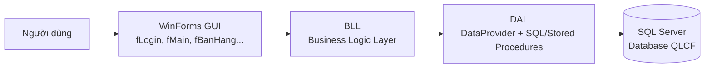
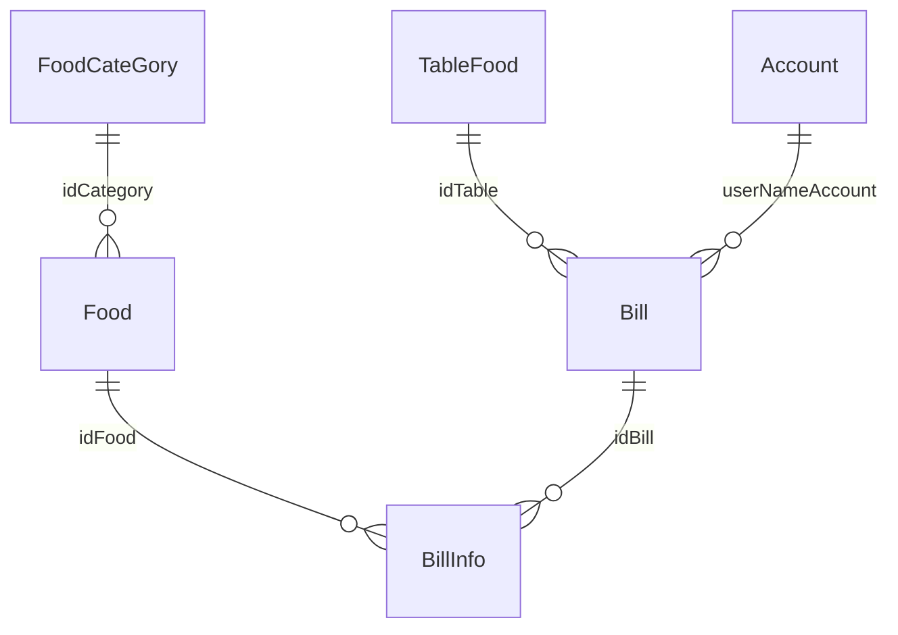

# Phần mềm Quản lý Quán Cà Phê (QLCF)

> Ứng dụng desktop quản lý bán hàng và vận hành quán cà phê, xây dựng bằng C# WinForms (.NET Framework 4.8) và SQL Server — đồ án học phần PBL3.

## 📖 Giới thiệu

Dự án là một phần mềm desktop dành cho việc quản lý quán cà phê quy mô nhỏ, giải quyết các công việc thường ngày như:

- Ghi nhận đơn hàng theo từng bàn và thanh toán (tính tiền, giảm giá, tiền thừa trả khách).
- Quản lý bàn, danh mục món, sản phẩm và nhân viên.
- Theo dõi ca làm việc của nhân viên và tính lương theo giờ.
- Thống kê doanh thu và mức độ bán của từng món bằng biểu đồ.

Hệ thống có **phân quyền theo vai trò**: tài khoản thuộc nhóm **Quản Lý** được sử dụng đầy đủ các chức năng; các vai trò còn lại (Pha Chế, Phục Vụ, Thu Ngân) chỉ thấy màn hình **Bán hàng**.

**Đối tượng sử dụng:** quán cà phê nhỏ, dùng nội bộ trên máy tính có cài SQL Server.

## ✨ Tính năng

Các chức năng dưới đây được triển khai trong source code:

- **Đăng nhập / tài khoản**
  - Đăng nhập với username + password (kiểm tra qua stored procedure `UseProc_Login`), ẩn/hiện mật khẩu.
  - Đổi mật khẩu & cập nhật số điện thoại của tài khoản đang đăng nhập (SP `USP_UpdateAccount`).
- **Bán hàng**
  - Hiển thị sơ đồ bàn với 2 trạng thái: `Trống` (☕ Coffee) và `Có người` (MugHot).
  - Chọn danh mục → chọn món (kèm ảnh lưu trong database) → thêm vào hoá đơn của bàn, tự động cộng dồn số lượng nếu món đã có.
  - Xem hoá đơn tạm của bàn (tên món, số lượng, đơn giá, thành tiền, tổng tiền).
  - Xoá món khỏi hoá đơn, huỷ toàn bộ hoá đơn của bàn.
  - Thanh toán: nhập giảm giá (%), bàn phím nhập tiền khách đưa, tự tính tiền thừa, in hoá đơn.
- **Quản lý nhân viên** *(chỉ Quản Lý)*
  - Danh sách nhân viên, tìm kiếm theo tên + vai trò.
  - Thêm / cập nhật / xoá nhân viên (xoá mềm nếu nhân viên đã có hoá đơn).
- **Quản lý danh mục** *(chỉ Quản Lý)*
  - Thêm / cập nhật / xoá / tìm kiếm danh mục; xoá danh mục sẽ xử lý cả các món bên trong.
- **Quản lý sản phẩm** *(chỉ Quản Lý)*
  - Thêm / cập nhật / xoá / tìm kiếm món ăn, nước uống; gán ảnh minh hoạ (lưu dưới dạng `image`/bytes trong SQL Server).
- **Quản lý bàn** *(chỉ Quản Lý)*
  - Thêm nhiều bàn cùng lúc (tự đặt tên "Bàn N"), xoá bàn, tìm kiếm bàn theo tên/id và trạng thái.
- **Thống kê** *(chỉ Quản Lý)*
  - Biểu đồ cột **doanh thu theo từng tháng** trong năm (tổng tiền sau giảm giá).
  - Biểu đồ tròn **số lần gọi của từng món**, lọc theo danh mục.
- **Hoá đơn** *(chỉ Quản Lý)*
  - Tra cứu hoá đơn đã thanh toán theo khoảng thời gian, theo mã hoá đơn hoặc tên bàn; xem chi tiết món, tổng tiền, giảm giá và thu ngân.
- **Lương** *(chỉ Quản Lý)*
  - Tổng hợp thời gian làm việc & lương theo tháng/năm; xem chi tiết từng lần đăng nhập/đăng xuất của một nhân viên.
- **Chấm công tự động**
  - Mỗi lần mở/đóng ứng dụng, thời gian đăng nhập/đăng xuất và lương theo giờ được ghi vào bảng `TimeKeeping`.

## 🛠️ Công nghệ sử dụng

| Thành phần | Công nghệ |
|---|---|
| Ngôn ngữ | C# |
| UI | Windows Forms (.NET Framework 4.8) |
| IDE / Build | Visual Studio 2022 (solution `Phanmem.sln`, MSBuild) |
| Database | SQL Server (kịch bản tạo DB `QLCF`) |
| Truy cập dữ liệu | ADO.NET (`System.Data.SqlClient`), kiến trúc 3 lớp DAL–BLL–DTO |
| Báo cáo | RDLC — Microsoft ReportViewer WinForms 15.0 (`rptReceipt.rdlc`) |
| Biểu đồ | `System.Windows.Forms.DataVisualization` (Chart) |
| Icon | FontAwesome.Sharp 5.15.4 |
| Khác | Microsoft.SqlServer.Types 14.0.314.76 (SqlServerTypes) |

## 🏗️ Kiến trúc hệ thống

Ứng dụng theo **kiến trúc 3 lớp** kinh điển:

- **GUI (các Form `f*.cs`)**: bắt sự kiện, hiển thị dữ liệu.
- **BLL (`BLL/`)**: nghiệp vụ — gọi DAL, cung cấp dữ liệu cho form.
- **DAL (`DAL/`)**: chứa toàn bộ câu lệnh SQL / gọi stored procedure, thực thi qua `DataProvider` (Singleton, ADO.NET).
- **DTO (`DTO/`)**: các lớp đối tượng truyền dữ liệu (Account, Bill, Food...).



Toàn bộ thông tin kết nối database nằm trong file `DAL/DataProvider.cs`.

## 📂 Cấu trúc thư mục

```
├── Phanmem.sln                     # Solution Visual Studio
├── scriptxxx.sql                   # Script tạo database QLCF (kèm dữ liệu mẫu)
└── PBL3_QuanLyQuanCafe/            # Project chính (WinForms)
    ├── Program.cs                  # Entry point — chạy fLogin trước tiên
    ├── App.config                  # Cấu hình runtime (.NET 4.8)
    ├── packages.config             # NuGet packages
    ├── fLogin.cs                   # Màn hình đăng nhập
    ├── fMain.cs                    # Màn hình chính, phân quyền theo menu
    ├── fBanHang.cs                 # Bán hàng: sơ đồ bàn, gọi món, hoá đơn
    ├── settlePayment.cs            # Màn hình thanh toán (bàn phím nhập tiền)
    ├── receipt.cs / rptReceipt.rdlc# In hoá đơn bằng ReportViewer (RDLC)
    ├── ChartForm.cs                # Thống kê doanh thu & món bán chạy
    ├── BillForm.cs                 # Tra cứu hoá đơn đã thanh toán
    ├── SalaryForm.cs               # Tổng hợp lương theo tháng
    ├── fNhanVien.cs / fThemNhanVien.cs / fDoiMK.cs   # Quản lý nhân viên & đổi mật khẩu
    ├── fSanPham.cs / fThemSanPham.cs / FCapNhatSanPham.cs   # Quản lý sản phẩm
    ├── fDanhMuc.cs / fThemDanhMuc.cs / fCapNhatDanhMuc.cs   # Quản lý danh mục
    ├── fBan.cs / fThemBan.cs       # Quản lý bàn
    ├── DAL/                        # Lớp truy cập dữ liệu (SQL, stored procedures)
    ├── BLL/                        # Lớp nghiệp vụ
    ├── DTO/                        # Các lớp đối tượng (Account, Bill, Food...)
    ├── DataSet1.xsd                # DataSet cho báo cáo RDLC
    ├── SqlServerTypes/             # Thư viện native của Microsoft.SqlServer.Types
    └── bin/Debug/Reports/rptReceipt.rdlc   # Báo cáo mà code thực sự load lúc chạy
```

## ⚙️ Yêu cầu môi trường

- **OS:** Windows (WinForms + ReportViewer chỉ chạy trên Windows).
- **.NET Framework 4.8** (đặt trong `App.config`).
- **Visual Studio 2017/2022** (solution tạo bằng VS 17.x) hoặc MSBuild.
- **SQL Server** (bản Express trở lên; script SQL thuần, không phụ thuộc phiên bản cụ thể).
- **SQL Server Management Studio (SSMS)** để chạy script database.

## 🚀 Cài đặt và chạy

1. **Clone project**

   ```bash
   git clone <URL-repo>
   cd <tên-repo>
   ```

2. **Tạo database**

   - Mở **SQL Server Management Studio**, kết nối tới SQL Server.
   - Mở và chạy toàn bộ file `scriptxxx.sql` (script tự tạo database `QLCF`, các bảng, function, stored procedure và dữ liệu mẫu).

3. **Mở solution và khôi phục packages**

   - Mở file `Phanmem.sln` bằng Visual Studio.
   - Chuột phải solution → **Restore NuGet Packages** (hoặc build lần đầu sẽ tự khôi phục).

4. **Cấu hình connection string** *(bắt buộc)* — xem mục [🔐 Cấu hình](#️-cấu-hình) bên dưới.

5. **Build & chạy**

   - Nhấn `F5` (Debug) trong Visual Studio, hoặc:

   ```bash
   msbuild Phanmem.sln /p:Configuration=Debug
   ```

6. **Đăng nhập** bằng tài khoản mẫu (mục [👤 Tài khoản demo](#-tài-khoản-demo)).

## 🔐 Cấu hình

Connection string được **hard-code** trong source code (không dùng file `.env`). Trước khi chạy, bạn cần sửa cho khớp máy của mình:

| Vị trí | Giá trị hiện tại | Dùng cho |
|---|---|---|
| `PBL3_QuanLyQuanCafe/DAL/DataProvider.cs` | `Data Source =L30; Database = QLCF; Integrated Security = True` | Toàn bộ ứng dụng |
| `PBL3_QuanLyQuanCafe/receipt.cs` (hàm `loadMoney`) | `Data Source = ADMIN-PC; Database = QLCF; Integrated Security = True` | In hoá đơn RDLC |

- Đổi `Data Source` thành tên máy/instance SQL Server của bạn (ví dụ `localhost`, `.\SQLEXPRESS`).
- Ứng dụng dùng **Windows Authentication** (`Integrated Security = True`); nếu dùng SQL login thì đổi thành `User Id=...;Password=...`.
- **Không đưa thông tin đăng nhập thật vào README hay commit lên repository.**

> ⚠️ Lưu ý: có **2 chỗ** phải sửa cùng lúc (xem mục [⚠️ Lưu ý](#️-lưu-ý)).

## 🗄️ Database

- **Tên database:** `QLCF` (script `scriptxxx.sql` tạo kèm dữ liệu mẫu).
- **7 bảng chính:**

| Bảng | Vai trò |
|---|---|
| `Account` | Tài khoản nhân viên: username, display name, password, giới tính, SĐT, địa chỉ, vai trò (`Type`: Quản Lý / Pha Chế / Phục Vụ / Thu Ngân), lương, ngày sinh, cờ `exist` |
| `TableFood` | Bàn trong quán: tên, trạng thái (`Trống` / `Có người`), cờ `exist` |
| `FoodCateGory` | Danh mục món (cà phê, trà sữa...), cờ `exist` |
| `Food` | Món ăn/nước: tên, đơn vị, giá, ảnh (`image`), thuộc danh mục, cờ `exist` |
| `Bill` | Hoá đơn: giờ vào/ra, giảm giá, tổng tiền, trạng thái (`0` = chưa thanh toán, `1` = đã thanh toán), nhân viên thanh toán |
| `BillInfo` | Chi tiết hoá đơn: từng món + số lượng |
| `TimeKeeping` | Chấm công: giờ đăng nhập/đăng xuất, số phút, lương theo giờ, lương của lượt làm |

- **Khóa ngoại:**



- **Objects đặc biệt trong script:**
  - **4 function sinh mã tự động:** `AUTO_IDBill()` (HD00001…), `AUTO_IDFood()` (M0001…), `AUTO_IDFoodCategory()` (DM001…), `AUTO_IDTableFood()` (B0001…) — gắn làm default cho cột `id`.
  - **5 stored procedure:** `UseProc_Login`, `USP_UpdateAccount`, `USP_GetListBillByDate`, `USP_GetListBillByDate1`, `USP_GetListBillFood`.
  - **Cờ mềm `exist`:** Account/Food/FoodCategory/TableFood không bị xoá vật lý khi còn ràng buộc dữ liệu — dữ liệu cũ được đánh dấu `exist = 0` để giữ nguyên lịch sử hoá đơn.

## 🔌 API

Đây là ứng dụng desktop thuần, **không có REST API**. Việc truy xuất dữ liệu diễn ra trực tiếp giữa BLL → DAL → SQL Server thông qua ADO.NET, gồm:

- Câu lệnh SQL parametrised / built-string trong các class `DAL/*.cs`.
- Gọi các stored procedure nêu ở mục [Database](#️-database).

## 👤 Tài khoản demo

Các tài khoản mẫu có sẵn trong `scriptxxx.sql` (password lưu dưới dạng plain text):

| Username | Password | Vai trò | Ghi chú |
|---|---|---|---|
| `admin` | `admin` | Quản Lý | Đầy đủ chức năng |
| `nvv` | `nvv` | Pha Chế | Chỉ thấy màn hình Bán hàng |
| `tinh1234` | `123` | Phục Vụ | Chỉ thấy màn hình Bán hàng |
| `123131` | `12313` | Thu Ngân | Chỉ thấy màn hình Bán hàng |

> Chỉ tài khoản có `Type = 'Quản Lý'` mới nhìn thấy các menu quản lý (Nhân viên, Danh mục, Sản phẩm, Bàn, Thống kê, Lương, Hoá đơn).

## 📚 Cách sử dụng

1. **Đăng nhập** — nhập username/password từ màn hình đầu tiên.
2. **Bán hàng** (mọi vai trò):
   - Chọn một bàn ở khung bên trái → danh sách món hiện ra bên phải.
   - Chọn danh mục → bấm món → đặt số lượng → **Thêm món**.
   - Xoá món bằng cách chọn dòng trong hoá đơn rồi bấm **Xoá món**; **Huỷ hoá đơn** để bỏ toàn bộ.
   - Bấm **Thanh toán**: nhập % giảm giá, nhập số tiền khách đưa trên bàn phím số → hệ thống tính tiền thừa → xác nhận → in hoá đơn RDLC và cập nhật trạng thái bàn.
3. **Quản trị** (Quản Lý): dùng menu bên trái để quản lý **Nhân viên, Danh Mục, Sản phẩm, Bàn**, xem **Thống kê**, **Hoá đơn** và **Lương**.
4. **Đổi thông tin cá nhân** — bấm icon tài khoản ở góc để đổi mật khẩu/SĐT; bấm nút thoát để đăng xuất (hệ thống tự ghi chấm công).

## 👨‍💻 Thành viên

- LeoUrion - Nguyễn Quốc Chuyên

---

## ⚠️ Lưu ý

Những điểm cần biết trước khi chạy project (tìm thấy khi đọc source, **chưa được sửa**):

1. **Connection string bị hard-code ở 2 nơi** (`DAL/DataProvider.cs`: `Data Source = L30`; `receipt.cs`: `Data Source = ADMIN-PC`) — phải sửa cả hai cho khớp máy của bạn, nếu không ứng dụng chạy được nhưng **in hoá đơn sẽ lỗi**.
2. **`receipt.cs` load báo cáo từ thư mục `bin/Debug/Reports/`** (`Application.StartupPath + @"\Reports\rptReceipt.rdlc"`) trong khi project nhúng `rptReceipt.rdlc` ở thư mục gốc. Thư mục `bin/Debug/Reports/` hiện có sẵn trong repo nên chạy Debug được; khi publish/deploy cần đảm bảo copy đúng thư mục này.
3. **SQL injection:** phần lớn truy vấn nối chuỗi trực tiếp giá trị người dùng (tìm kiếm, đăng nhập, đăng ký...). Đây là project học tập — không dùng cho môi trường thực tế mà không refactor sang parameterised query hoàn toàn.
4. **Mật khẩu lưu plain text** trong bảng `Account` và hiển thị cả trong grid quản lý nhân viên.
5. `dentaT`, `totalSalary` trong bảng `TimeKeeping` được tính bởi trigger/database bên ngoài script đi kèm — script `scriptxxx.sql` **không chứa trigger** tính 2 cột này; nếu lương hiển thị 0, cần bổ sung logic (hoặc kiểm tra lại script gốc dùng cho DB thật).
6. File `scriptxxx.sql` là bản **full dump kèm dữ liệu hoá đơn mẫu** (khoảng 13.7MB) — nếu chỉ cần schema, hãy bỏ phần `INSERT` khi xuất lại.
